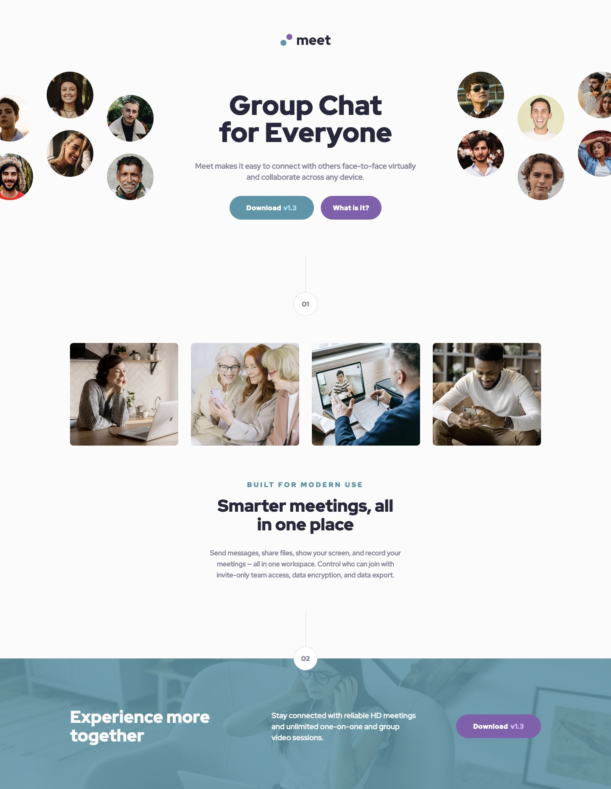

# Meet landing page solution

This is a solution to the [Meet landing page challenge on Frontend Mentor](https://www.frontendmentor.io/challenges/meet-landing-page-rbTDS6OUR).

## Table of contents

-   [Screenshot](#screenshot)
-   [Links](#links)
-   [Built with](#built-with)
-   [Author](#author)

## Screenshot

## Links

-   [Solution URL](https://github.com/ionStici/meet-landing-page)
-   [Live Site URL](https://ionstici.github.io/meet-landing-page)

## Built with

-   Sass (Scss)
-   Semantic HTML5 markup
-   Flexbox and CSS Grid

## What I learned

Using the mobile-first approach for the first time! It feels like you have better control over the layout.

## Author

-   [GitHub](https://github.com/ionStici)
-   [Frontend Mentor](https://www.frontendmentor.io/profile/ionStici)
-   [Twitter](https://twitter.com/ionStici_)
