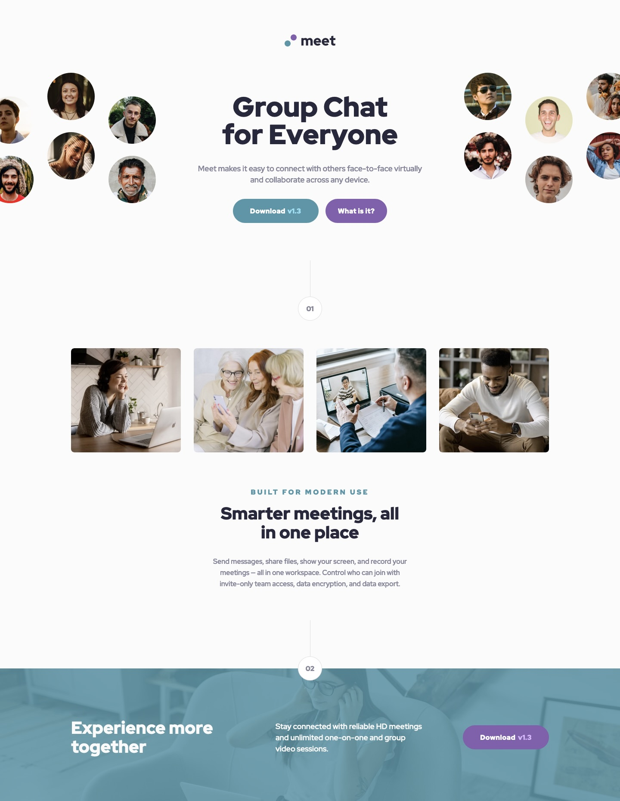

# Meet Landing Page Solution

This is a solution to the [Meet landing page challenge on Frontend Mentor](https://www.frontendmentor.io/challenges/meet-landing-page-rbTDS6OUR). The project is a landing page for a group chat application built using **HTML**, **CSS**, and **Sass**. It features a modern, clean layout with a focus on user interaction and smart meeting features.

## What I learned

Using the mobile-first approach for the first time! It feels like you have better control over the layout.

## Screenshot and Links

| [Fem URL](https://www.frontendmentor.io/solutions/meet-landing-page-q9YRdwCxss) | [Live Demo](https://ionstici.github.io/meet-landing-page) |
| ------------------------------------------------------------------------------- | --------------------------------------------------------- |

